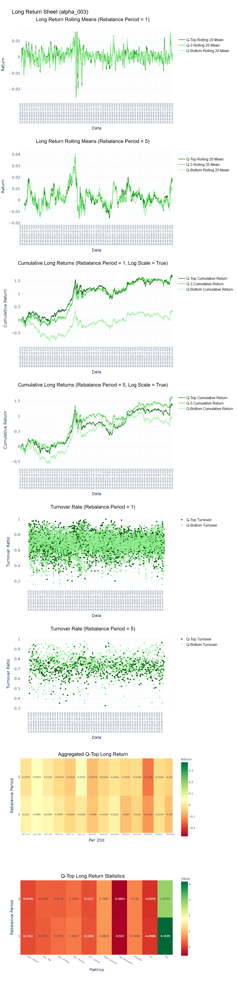
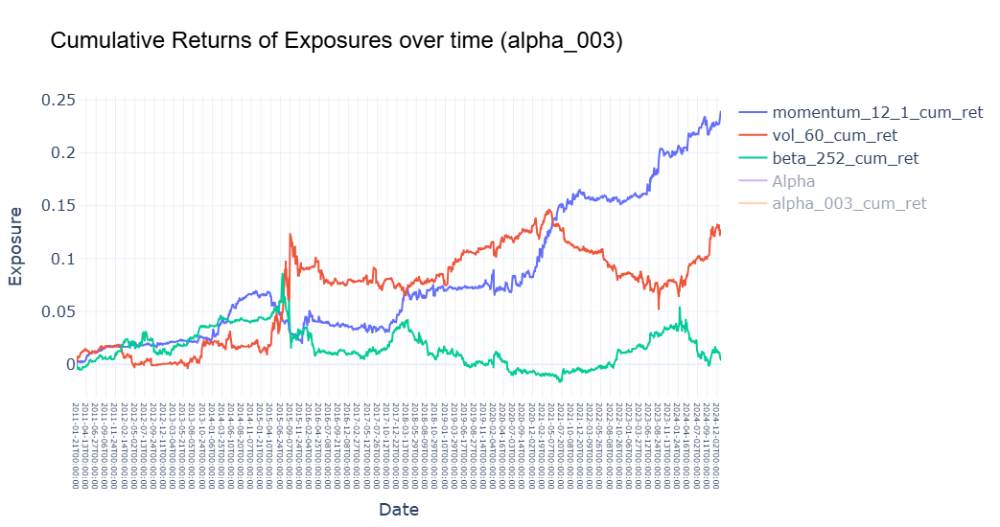
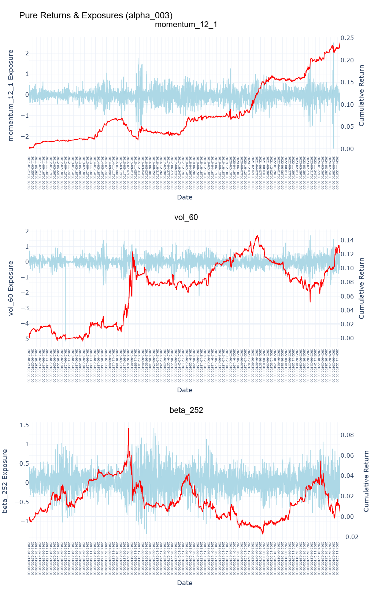
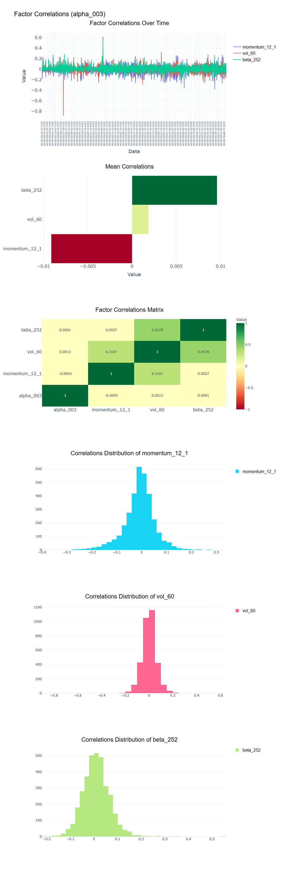

<p align="center">
  <a href="https://pypi.python.org/pypi/alphapurify">
    
  </a>
  <a href="https://pypi.python.org/pypi/alphapurify">
    
  </a>
  <a href="https://pypi.python.org/pypi/alphapurify">
    
  </a>
  <a href="LICENSE">
    
  </a>
  <a href="https://pypi.org/project/alphapurify/#files">
    
  </a>
</p>

<p align="center">
  <a href="README.md">English README</a> | <a href="README_CN.md">简体中文 README</a> | <a href="README_CN2.md">繁体中文 README</a>
</p>

# AlphaPurify：面向量化研究員的因子分析庫

**AlphaPurify** 庫用於因子構建、因子預處理、因子回測和因子收益率歸因，幫助量化研究員快速驗證想法。

---

## 4个主要功能:

  1.**`alphapurify.FactorAnalyzer`** — 用於IC/ Rank IC測試和多頭，空頭，多空分層測試。

  2.**`alphapurify.AlphaPurifier`** — 用於因子預處理，包括40+的去極值、中性化和標準化方法(e.g.，ridge迴歸，lasso迴歸，PCA分解，etc.).

  3.**`alphapurify.Database`** — 用於金融數據聚合、因子構建和因子入庫。

  4.**`alphapurify.Exposures`** — 用於因子相關性分析和因子收益率歸因分析。

---

## Pipeline Overview


---

### 完整文檔及示例: **[English docs](./examples)**

---

## 主要優點:
### - 極致高性能 — 在標準 i7 CPU 上，可在 25 秒內處理 400 萬+ 行數據（15 年滬深 300），包括多頭/空頭、多空以及 IC 回測，並生成 4 個交互式報告。
### - 大規模穩定性 — 可靠支持千萬級數據（如分鐘級數據），並通過內存優化設計防止溢出。
### - 40+ 因子預處理方法 — 內置專業的因子清洗工具，支持從超高頻到低頻的數據處理需求。
### - 靈活週期支持 — 支持同時運行無限數量的調倉週期和 IC 觀測窗口，實現豐富的多維因子分析。

---

## AlphaPurify vs 其他量化库

| 領域 / 庫 | AlphaPurify | Qlib | Backtrader | Alphalens | QuantStats | Pyfolio |
|:------------------|:------------|:--------|:------------|:------------|:-------------|:-------------|
| 計算速度 | 🚀 極速 (Rust向量化 + 多進程) | ❌ 慢 (重基礎設施) | ⚠️ 中等 | ✅ 快 | 無回測 | 無回測 |
| 因子預處理 (40+) | ✅ 原生內置 | ⚠️ 有限制 | ❌ 無 | ❌ 無 | ❌ 無 | ❌ 無 |
| IC 分析 | ✅ 原生內置 | ✅ 支持 | ❌ 無 | ✅ 支持 | ❌ 無 | ❌ 無 |
| 多頭 / 空頭 / 多空再平衡分層回測 | ✅ 原生內置 | ✅ 支持 | ⚠️ 不直接支持 | ❌ 無 | ❌ 無 | ❌ 無 |
| 因子收益率歸因 | ✅ 支持 | ⚠️ 不直接支持 | ❌ 無 | ❌ 無 | ❌ 無 | ❌ 無 |
| 多頻率bar支持 | ✅ 任意 (微秒 → 年頻率) | ⚠️ 有限制 | ⚠️ 日頻 | ⚠️ 日頻 | ⚠️ 有限制 | ⚠️ 有限制 |
| 複雜度 | 🟢 低 | 🔴 高 | 🟡 中等 | 🟢 低 | 🟢 低 | 🟢 低 |
| 數據庫支持 | ✅ Parquet + DuckDB | ⚠️ 傳統架構 | ❌ 無 | ❌ 無 | ❌ 無 | ❌ 無 |

``AlphaPurify``雖然看起來``Alphalens``，但它遠遠超出了IC分析和簡單圖表的範疇。它支持多頭，空頭，多空的再平衡回測、因子清洗、因子收益率歸因，並由 Plotly 提供新一代交互式可視化圖表。

``AlphaPurify``跟``QuantStats``和``Pyfolio``這些主要關注收益率曲線和投資組合表現分析而非回測的庫不同。但是相比於``Qlib``和``Backtrader``等工具，``AlphaPurify``直接提供了輕量級、快速的因子驅動再平衡回測框架——用戶無需在這些庫中自己寫複雜的流水線或回測流程。

簡而言之，``AlphaPurify``爲量化研究員提供全因子測試流程和精美的互動報告，以快速驗證想法。

---

##  快速開始

### 1.使用pip安裝
用戶可以通過以下命令輕鬆通過 pip 安裝``AlphaPurify``。

```bash
pip install alphapurify
```
注意：pip 會安裝最新的穩定版``AlphaPurify``。不過，AlphaPurify的主分支正在積極開發中。如果你想測試主分支中最新的腳本或函數，請用克隆安裝。

---

### 2.加載你的DataFrame
| datetime           | symbol | close | volume | alpha_003 | momentum_12_1 | vol_60 | beta_252 |
|:-------------------|:------|------:|------:|------:|--------------:|------:|--------:|
| 2024-01-01 09:30   | AAPL  | 189.9 | 120034 | 0.42 | 0.15 | 0.21 | 1.08 |
| 2024-01-01 09:31   | AAPL  | 190.0 | 98321  | 0.38 | 0.16 | 0.22 | 1.07 |
| 2024-01-01 09:32   | AAPL  | 190.4 | 101245 | 0.41 | 0.17 | 0.23 | 1.06 |
| 2024-01-01 09:30   | MSFT  | 378.5 | 84211  | -0.15 | -0.05 | 0.18 | 0.95 |
| 2024-01-01 09:31   | MSFT  | 378.9 | 90122  | -0.12 | -0.04 | 0.19 | 0.96 |
| 2024-01-01 09:32   | MSFT  | 379.1 | 95433  | -0.08 | -0.03 | 0.20 | 0.97 |

**p.s. 你的數據框架必須包含時間欄、標的標識欄、價格欄和因子欄，以確保正確使用。**

---

### 3.創建回測報告
```bash
from alphapurify import AlphaPurifier, FactorAnalyzer

# preprocess
df = (
    AlphaPurifier(df, factor_col="alpha_003")
    .winsorize(method="mad")
    .standardize(method="zscore")
    .to_result()
)

#backtest
FA = FactorAnalyzer(base_df=df,
                    trade_date_col='datetime',
                    symbol_col='symbol',
                    price_col='close',
                    factor_name='alpha_003')
FA.run()
FA.create_long_return_sheet()
FA.create_long_short_return_sheet()
FA.create_short_return_sheet()
FA.create_single_fac_ic_sheet()

#contributions of other factors
Ex = PureExposures(
    base_df=df,
    trade_date_col='datetime',
    symbol_col='symbol',
    price_col='close',
    factor_name='alpha_003',
    exposure_cols=['momentum_12_1', 'vol_60', 'beta_252'],
)

Ex.run()
Ex.plot_pure_exposures()
Ex.plot_pure_returns()
Ex.plot_pure_exposures_and_returns()
Ex.plot_correlations()
```

---

## 回測報告示例
### 僅限多頭頭寸的回測組合：

### 因子值和收益率的歸因分析:




---

### 如果你喜歡``AlphaPurify``， 請爲這個項目star並fork以支持開發！

---

**Elias Wu 吳一鳴**


